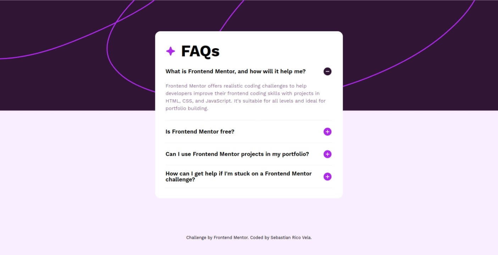
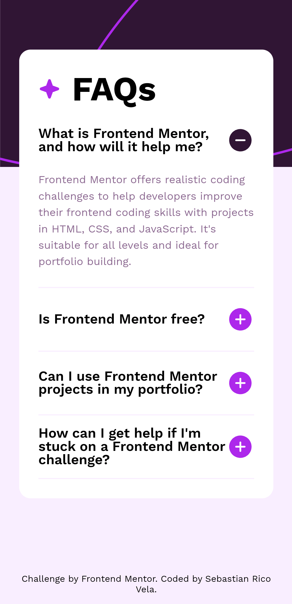

# Frontend Mentor - Social links profile solution

This is a solution to the [FAQ accordion challenge on Frontend Mentor](https://www.frontendmentor.io/challenges/faq-accordion-wyfFdeBwBz).

## Table of contents
- [Frontend Mentor - Social links profile solution](#frontend-mentor---social-links-profile-solution)
  - [Table of contents](#table-of-contents)
  - [Overview](#overview)
    - [Screenshot](#screenshot)
    - [Links](#links)
    - [Built with](#built-with)
    - [What I learned](#what-i-learned)
  - [Author](#author)

## Overview
This is a simple page to practice HTML and CSS. 
The challenge comes from the Frontend Mentor page. 

### Screenshot

### Links
- Solution URL: [Link](https://faqaccordion-agilepanda482.netlify.app/)

### Built with
- HTML5
- CSS
- Flexbox
- Mobile-first workflow

### What I learned
The highlight of developing this page was to understand how with JavaScript I can manipulate the DOM, so I also understood a little bit how ForEach works.

## Author
- Frontend Mentor - [@AgilePanda482](https://www.frontendmentor.io/profile/AgilePanda482)
- Linkedin - [@AgilePanda482](https://www.linkedin.com/in/AgilePanda482/)
